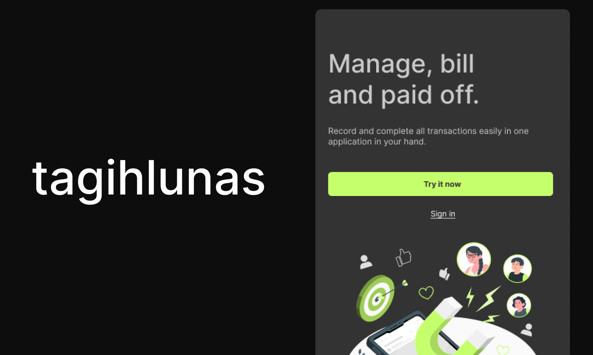
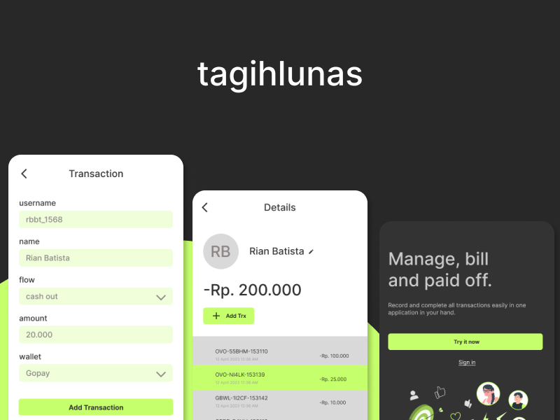

# Tagih Lunas

Tagihlunas  is made to help record all bills of money borrowed by others.

## List Packages

- [avatar-initials](https://www.npmjs.com/package/avatar-initials)
- [nanoid](https://www.npmjs.com/package/nanoid)
- [vuelidate](https://vuelidate-next.netlify.app/)
- [vitest](https://vitest.dev/)
- [Welcome to V-Money-Spinner](https://www.npmjs.com/package/v-money-spinner)

## Shots

## References

1. [Vue.js 3 TypeScript Refs, Complex types & Interfaces Tutorial](https://www.koderhq.com/tutorial/vue/typescript-ref/)
2. [Typescript: Argument of type 'string | undefined' is not assignable to parameter of type 'string'](https://stackoverflow.com/questions/65868394/typescript-argument-of-type-string-undefined-is-not-assignable-to-parameter)
3. [Vue Router Router and Component Guards and Navigation Resolution Flow](https://javascript.plainenglish.io/vue-router-router-and-component-guards-and-navigation-resolution-flow-f4a407eb7197)
4. [Use Supabase Auth with Vue.js 3](https://vueschool.io/articles/vuejs-tutorials/use-supabase-auth-with-vue-js-3/)
5. [How to access $route.params in Vue.js?](https://pinoria.com/how-to-access-route-params-in-vue-js/)
6. [Typing `ref()`](https://vuejs.org/guide/typescript/composition-api.html#typing-ref)
7. [Font Awesome with VueJS 3](https://dev.to/sabbirsobhani/font-awesome-with-vuejs-3-59ee)
8. [Add Icons with Vue: Doc FontAwesome](https://fontawesome.com/docs/web/use-with/vue/add-icons)
9. [Here is Vue 3 version of a simple search.](https://stackoverflow.com/a/67719932)
