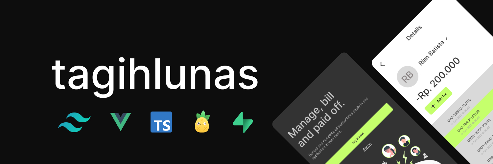

# Tagih Lunas (in development) ⚙️




Tagihlunas  is made to help record all bills of money borrowed by others.

## Demo

email: `test@tagihlunas.com`

pswd: `tagihlunas123`

## Shots


# Postgresql Definitions

## Table Users

```sql
create table
  public.users (
    id bigint generated by default as identity not null,
    admin_id uuid null,
    user_id text null,
    created_at timestamp with time zone not null default now(),
    name text not null,
    username text not null,
    color_profile text null,
    constraint users_pkey1 primary key (id),
    constraint users_user_id_key unique (user_id),
    constraint users_username_key unique (username),
    constraint users_admin_id_fkey foreign key (admin_id) references auth.users (id)
  ) tablespace pg_default;
```

## Table Transacations

```sql
create table
  public.transactions (
    id bigint generated by default as identity not null,
    created_at timestamp with time zone null default now(),
    user_id text null,
    flow character varying not null,
    amount numeric not null default '0'::numeric,
    wallet character varying not null,
    trx_id character varying not null,
    message character varying null,
    constraint transactions_pkey primary key (id),
    constraint transactions_trx_id_key unique (trx_id),
    constraint transactions_user_id_fkey foreign key (user_id) references users (user_id)
  ) tablespace pg_default;

```
